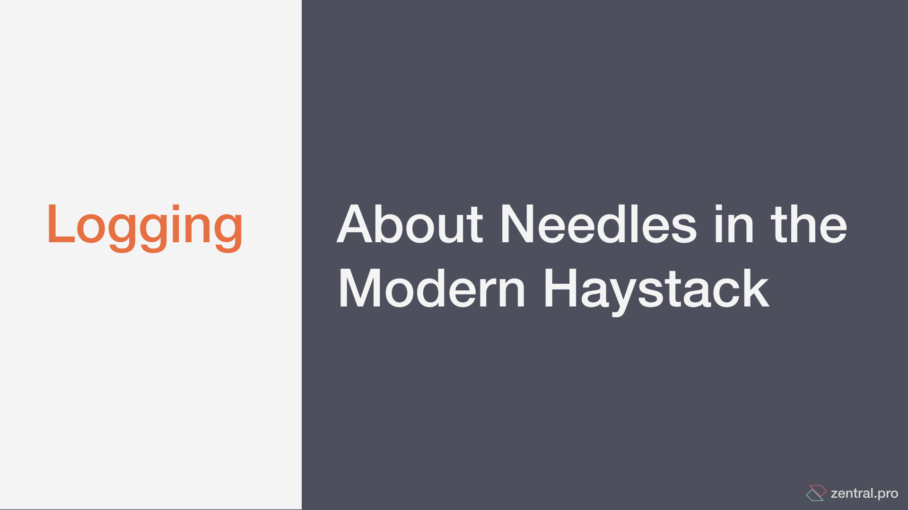

# MacSysAdmin-Conference-2019

Complementary notes for **MacSysAdmin-Conference-2019** presentation: _"LOGGING - About Needles in the Modern Haystack"_

- MacSysAdmin-Conference-2019 (English) [details here](https://www.macsysadmin.se/program.html)
- Conference Date: **01. October 2019**

Video: http://docs.macsysadmin.se/2019/video/Day1Session7.mp4
Slides: http://docs.macsysadmin.se/2019/pdf/Day1Session7.pdf

# Slides (english)

Here you'll find the [english version](./pdf/MacSysAdmin-Conference-2019.pdf) of our slides. 

# Who are we ?

We are [Zentral Pro Services](https://www.zentral.pro/) - a consulting, research and development company.
We help clients unleash the potential of their Apple devices in a business environment.

We also build [Zentral opensource](https://github.com/zentralopensource/zentral/wiki).

---

# Follow-Up Links

### Apple Security Extension (macOS 10.15)

- https://developer.apple.com/documentation/systemextensions
- https://developer.apple.com/documentation/endpointsecurity#overview

### macOS Endpoint Monitoring *(open source)*
- https://osquery.io
- https://github.com/google/santa
- https://www.roe.ch/xnumon
- https://github.com/zentralopensource/zentral/releases
- https://github.com/objective-see/ProcessMonitor
- https://github.com/objective-see/FileMonitor

## Apple Unified Logging

- https://eclecticlight.co/2018/03/19/macos-unified-log-1-why-what-and-how/
- https://eclecticlight.co/2016/10/17/log-a-primer-on-predicates/
- https://eclecticlight.co/

###  Log Analytic solutions

- https://www.elastic.co/products/elastic-stack/features (open source and cloud)
- https://github.com/zentralopensource/zentral
- https://sumologic.com
- https://www.splunk.com/
- https://www.datadoghq.com/

## Microsoft Event Hub & Graph Security API

- https://www.microsoft.com/en-us/security/partnerships/graph-security-api

### Security Incident Event Management (SIEM) Solutions
- [Elastic SIEM](https://www.elastic.co/products/siem)
- [Chronicle](https://chronicle.security/)
- [Azure Sentinel](https://azure.microsoft.com/en-gb/blog/introducing-microsoft-azure-sentinel-intelligent-security-analytics-for-your-entire-enterprise/)
- [Arc Site](https://www.microfocus.com/en-us/products/siem-security-information-event-management/overview)
- [Q-Radar](https://www.ibm.com/marketplace/ibm-qradar-siem)

### SIEM thoughs

- https://medium.com/anton-on-security/one-of-the-most-common-questions-i-received-in-my-analyst-years-of-covering-siem-and-other-3480cb755a3e
